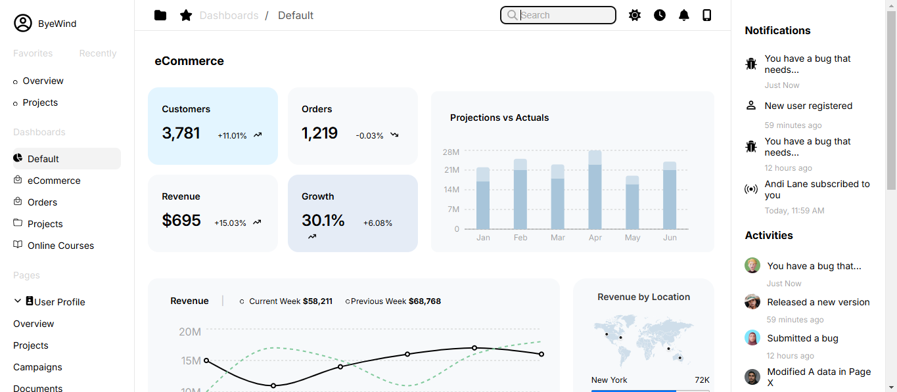
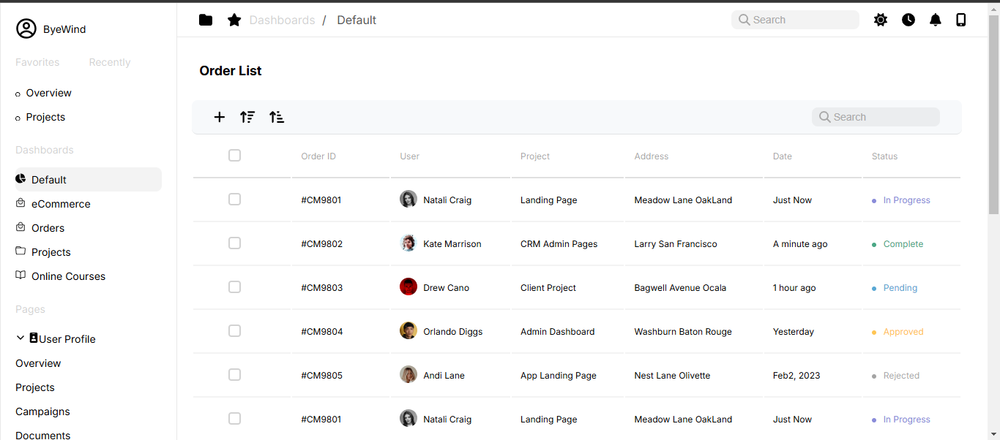

# Juspay Assignment

This project is a frontend web page built with **ReactJS** for a Juspay assignment. It demonstrates the integration of various React components and third-party libraries, including charting and icon sets. 

## Table of Contents

- [Installation](#installation)
- [Technologies Used](#technologies-used)
- [Features](#features)
- [Usage](#usage)
- [Screenshots](#screenshots)
- [Development](#development)
- [Contributing](#contributing)
- [License](#license)

## Installation

To set up this project on your local machine, follow these steps:

1. Clone the repository:
   ```bash
   git clone https://github.com/your-username/juspay-assignment.git
   ```
   
2. Navigate into the project directory:
   ```bash
   cd juspay-assignment
   ```

3. Install the required dependencies:
   ```bash
   npm install
   ```

## Technologies Used

This project uses the following technologies and libraries:

- **React** (v19.0.0) – Frontend JavaScript library for building user interfaces
- **Chart.js** – For rendering charts
- **React Router DOM** – For handling routing in the app
- **Reactstrap** – For Bootstrap-based UI components
- **Recharts** – For rendering charts and graphs
- **FontAwesome** – For icons
- **React Testing Library** – For unit testing

### Dependencies:
- **@fortawesome/fontawesome-svg-core**
- **chart.js**
- **react-chartjs-2**
- **reactstrap**
- **react-icons**
- **react-router-dom**

## Features

- A responsive UI designed with **ReactJS** and **Reactstrap**.
- **Dynamic charts** generated using **Chart.js** and **Recharts**.
- **Icon integration** using **FontAwesome**.
- Routing handled by **React Router DOM**.

## Usage

To start the application in development mode:

```bash
npm start
```

This will run the app on `http://localhost:3000`.

### Build for Production

To create a production build of your application:

```bash
npm run build
```

### Run Tests

To run tests for your application:

```bash
npm test
```

## Screenshots

  
*Screenshot of the homepage.*

  
*Screenshot of the order Lst.*

## Development

For local development, this project uses `create-react-app`:

- **React Scripts**: This is used to run, test, and build the project.
- **Testing**: All tests can be run with `npm test`. This uses the **React Testing Library** for writing unit and integration tests.

## Contributing

Feel free to fork this repository and submit a pull request if you'd like to contribute. Please make sure to follow the contribution guidelines if applicable.

## License

This project is licensed under the MIT License - see the [LICENSE](LICENSE) file for details.
